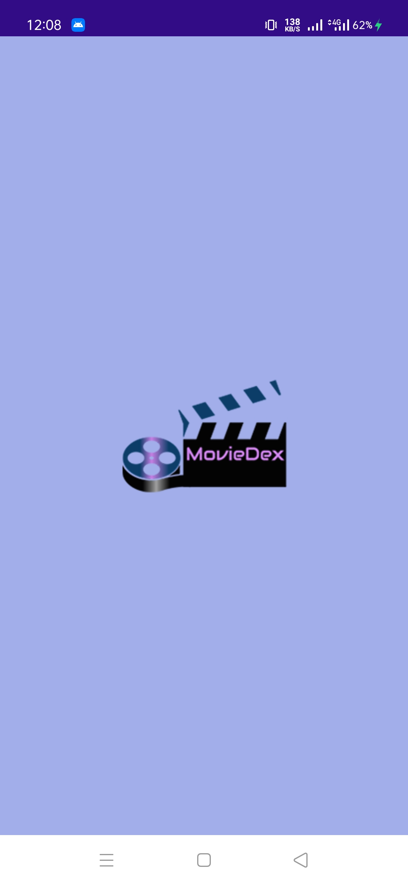
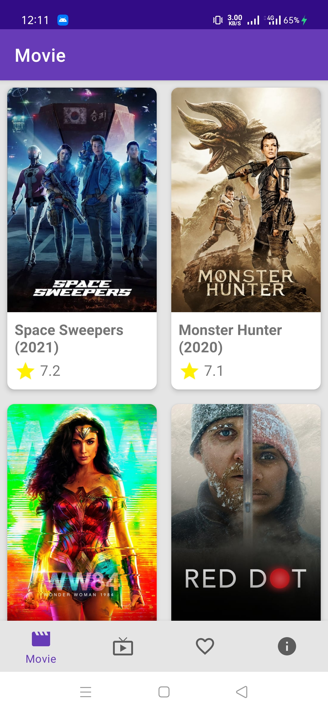
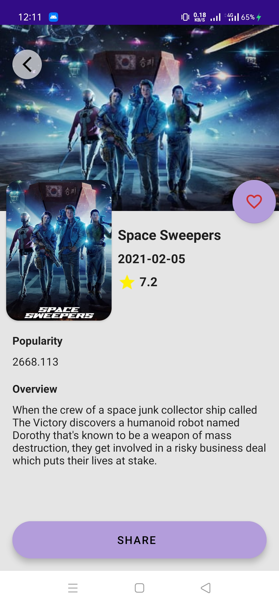
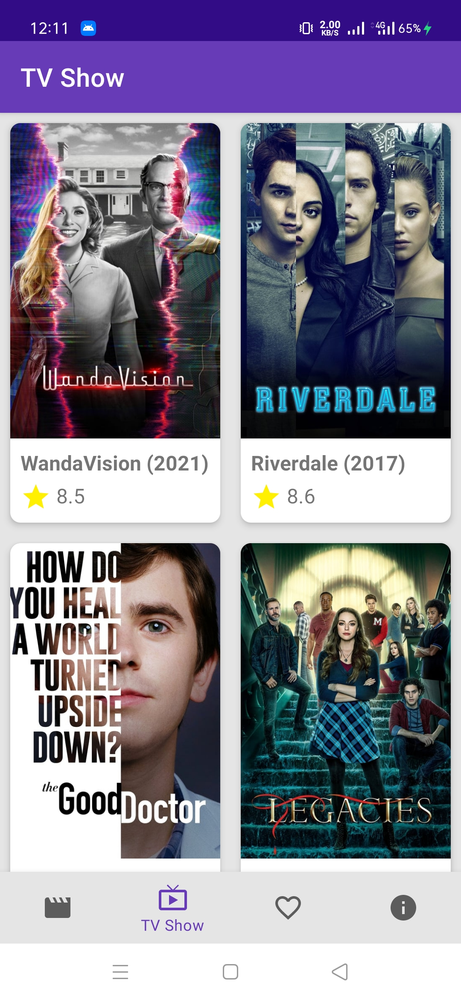
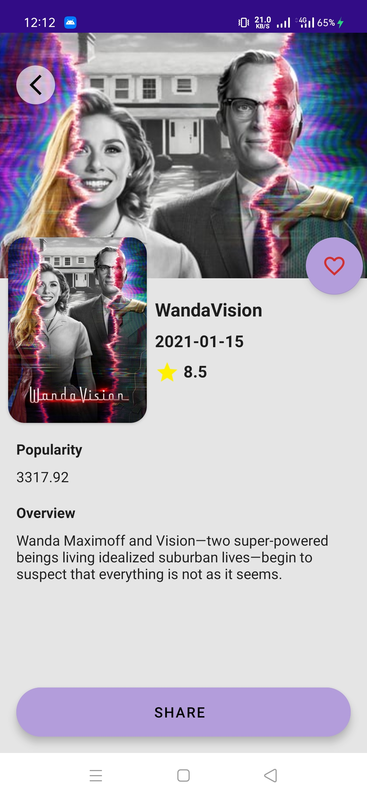
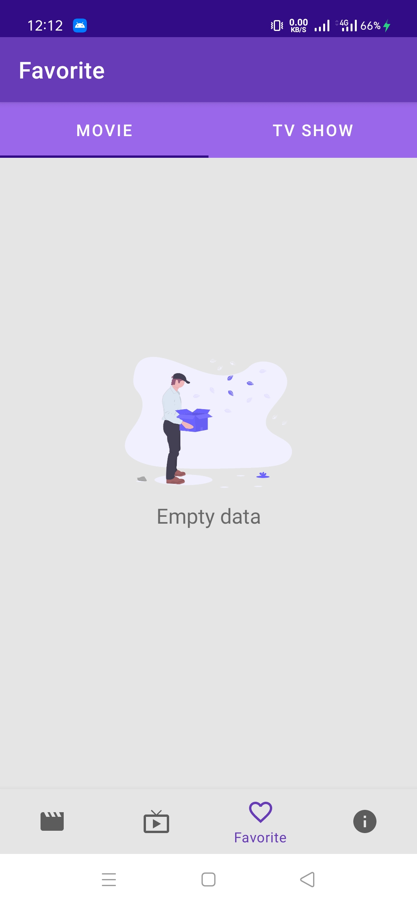
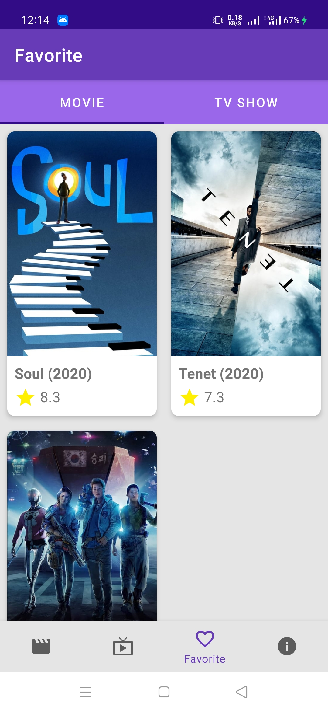
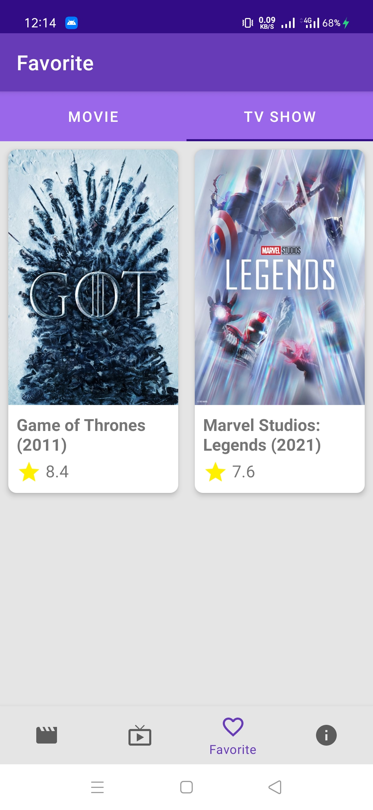

<p align="center">
  <a href="https://github.com/nicktra/moviedex">
    
  </a>
</p>

<h3 align="center">MovieDex</h3>

<p align="center">
    MovieDex is android app about Movies and TV Shows with Clean Architecture, Dependency Injection, and Modularization.
    <br />
    <a href="https://github.com/nicktra/moviedex"><strong>Explore the docs »</strong></a>
    [](https://circleci.com/gh/nicktra/moviedex)
</p>


# MovieDex

MovieDex is android app about Movies and TV Shows with Clean Architecture, Dependency Injection, and Modularization.

## Getting Started

These instructions will get you a copy of the project up and running on your local machine for development and testing purposes.

### Prerequisites

Things you need to install the software and how to install them

* Android Studio (I use Android Studio 4.1.1)

### Installing

1. Clone the repo
```sh
git clone https://github.com/nicktra/moviedex.git
```
2. Open with your Android Studio

## Features

* Popular Movies
* Popular TV Shows
* Favorited Movies & TV Shows
* Detail Movie & TV Show
* Share Movie & TV Show
* Support Dark Theme

## Screenshots App
<pre>
                                
</pre>

## Built With

* [Kotlin](https://kotlinlang.org/) - The Programming Language
* [Retrofit](https://github.com/square/retrofit) A type-safe HTTP client for Android
* [View Binding](https://developer.android.com/topic/libraries/view-binding) is a feature that allows you to more easily write code that interacts with views.
* [LiveData](https://developer.android.com/topic/libraries/architecture/livedata) is an observable data holder class.
* [Navigation Component](https://developer.android.com/guide/navigation) helps you implement navigation, from simple button clicks to more complex patterns, such as app bars and the navigation drawer.
* [Room](https://developer.android.com/topic/libraries/architecture/room) persistence library provides an abstraction layer over SQLite to allow for more robust database access while harnessing the full power of SQLite.
* [ViewModel](https://developer.android.com/topic/libraries/architecture/viewmodel) class is designed to store and manage UI-related data in a lifecycle conscious way. 
* [Lifecycle](https://developer.android.com/topic/libraries/architecture/lifecycle) Lifecycle-aware components perform actions in response to a change in the lifecycle status of another component, such as activities and fragments.
* [Paging](https://developer.android.com/topic/libraries/architecture/paging) The Paging Library helps you load and display small chunks of data at a time. Loading partial data on demand reduces usage of network bandwidth and system resources.
* [Glide](https://github.com/bumptech/glide) is a fast and efficient open source media management and image loading framework for Android that wraps media decoding, memory and disk caching, and resource pooling into a simple and easy to use interface.
* [CircleImageView](https://github.com/hdodenhof/CircleImageView) A circular ImageView for Android
* [Mockito](https://github.com/mockito/mockito) Most popular Mocking framework for unit tests written in Java.
* [Espresso](https://developer.android.com/training/testing/espresso/index.html) write concise, beautiful, and reliable Android UI tests.


## Contributing

Contributions are what make the open source community such an amazing place to be learn, inspire, and create. Any contributions you make are **greatly appreciated**.

1. Fork the Project
2. Create your Feature Branch (`git checkout -b feature/AmazingFeature`)
3. Commit your Changes (`git commit -m 'Add some AmazingFeature'`)
4. Push to the Branch (`git push origin feature/AmazingFeature`)
5. Open a Pull Request

## Contact

* **Konik Saputra** - [@koniksaputra](https://twitter.com/koniksaputra) - koniksaputra@live.com

## License

This project is licensed under the MIT License. See `LICENSE` for more information